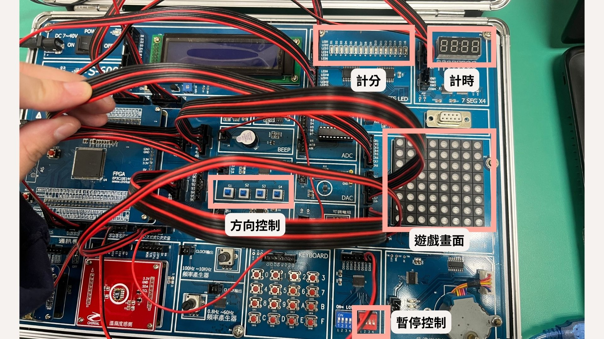
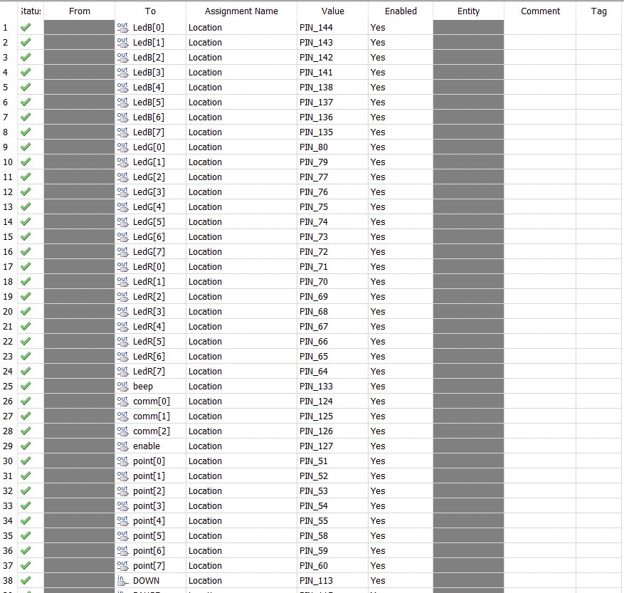
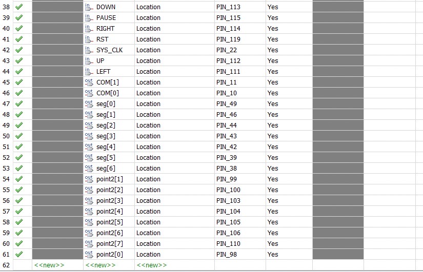

# FPGA_snake_game_contest
> [vale5230-Snake-Game-in-FPGA](https://github.com/vale5230/Snake-Game-in-FPGA)

從開源的專案做修改，讓一款經典的遊戲不僅呈現在FPGA上，並為其增添更多功能

組員:
```
109213017
111213001
111213005
```

## 目錄:
* 1. [Requirement](/README.md#Requirement)
* 2. [Usage](/README.md#Usage)
* 3. [參考](/README.md#參考)

## Requirements

### 晶片請使用 Cyclone III EP3C10E144C8
### 介面

###  遊戲畫面

### Pin腳位:


## Usage

* 原有功能: 在8x8的LED全彩點矩陣上，隨機生成蛇的食物(會避開蛇的身體位置)、暫停功能、超過8分就將蛇的身體變色

* 1. 蛇吃到食物後會觸發蜂鳴器beep一聲(2023/12/30 新增)
* 2. 用七段顯示器~16-bits LED顯示玩家遊玩時間 (2023/12/30 新增)
* 3. 將獲得的食物(分數)顯示在16-bits LED顯示:1-8分藍色，9-16綠色 (2023/01/02 新增)
* 4. 新增第二顆食物 (2024/01/02 新增)


<table>
  <tr>
    <th>操控功能</th>
    <th>控制元件</th>
    <th>備註</th>
  </tr>
  <tr>
    <td>上</td>
    <td>S1</td>
    <td>在4 BITS SW</td>
  </tr>
  <tr>
    <td>下</td>
    <td>S2</td>
    <td>在4 BITS SW</td>
  </tr>
  <tr>
    <td>左</td>
    <td>S3</td>
    <td>在4 BITS SW</td>
  </tr>
  <tr>
    <td>右</td>
    <td>S4</td>
    <td>在4 BITS SW</td>
  </tr>
  <tr>
    <td>暫停</td>
    <td>紅色第3號</td>
    <td>在8 DIPSW</td>
  </tr>
</table>
DEMO影片：https://drive.google.com/file/d/1FG_OmrJjJJQXoYmiKrja0zRQJEnsirNF/view?usp=drive_link
/圖2
/圖3
/圖4

## 參考
https://github.com/vale5230/Snake-Game-in-FPGA
